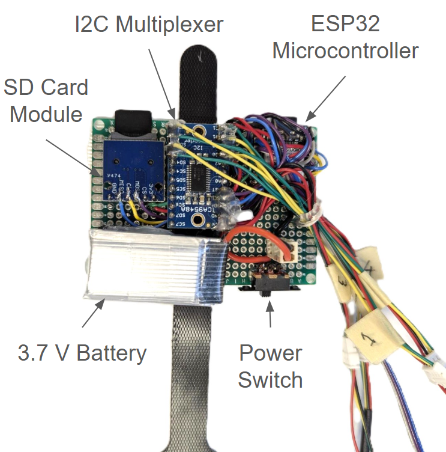
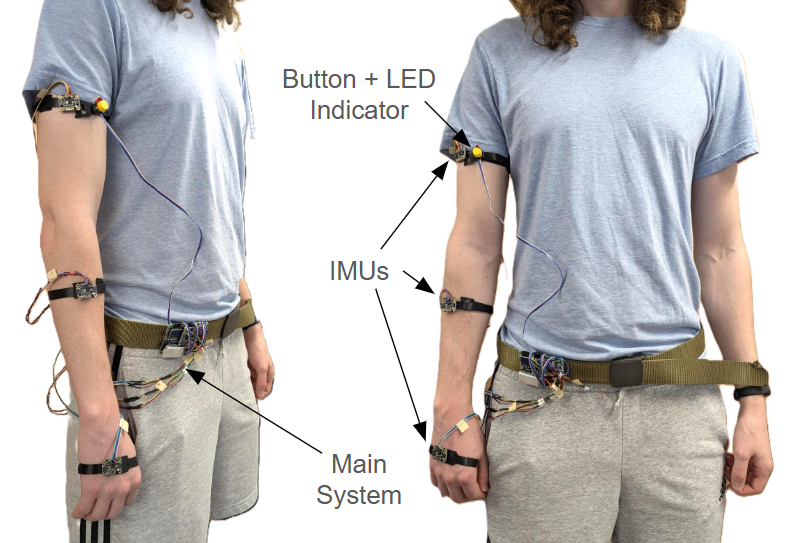
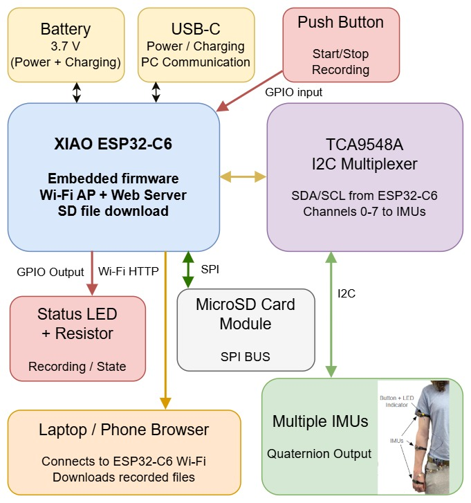
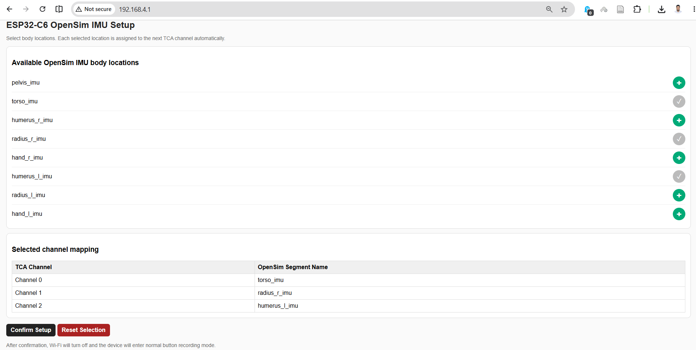
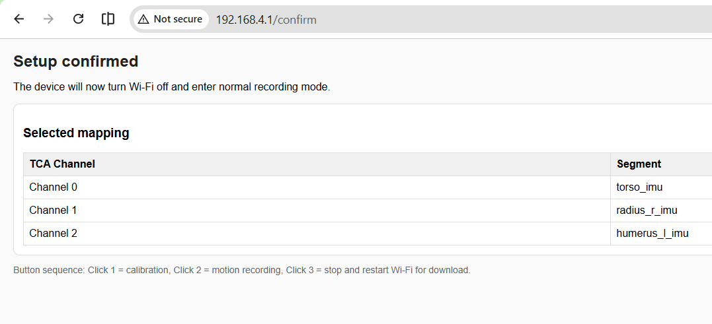
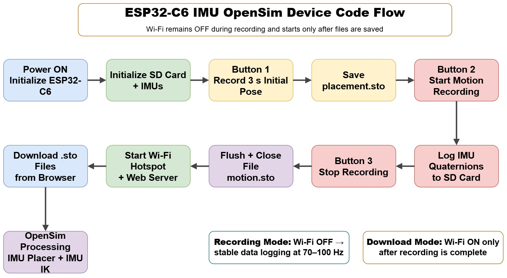

# ESP32-C6 OpenSim IMU Logger

A low-cost, low-power, wearable IMU data logger for collecting **OpenSim-compatible quaternion motion data** using an ESP32-C6 microcontroller, BNO055 IMUs, a TCA9548A I2C multiplexer, microSD card storage, and an onboard Wi-Fi web interface.

The device records `.sto` files directly to the microSD card, supports **dynamic IMU-to-body-segment mapping** from a browser, saves the selected configuration, and allows recorded files to be downloaded over Wi-Fi after recording. Users can change the number of tracked body segments without modifying or re-uploading the firmware.

**Repository:** https://github.com/Nabilphysics/opensim  
**Demo video:** https://youtu.be/UPFFH3lmV-8

[](https://youtu.be/UPFFH3lmV-8)

---

## Contributors

- **Syed Razwanul Haque**, Robotics PhD Student, Oregon State University, USA
- **Nathan Jones**, Robotics PhD Student, Oregon State University, USA

---

## Project Highlights

- ESP32-C6 based embedded IMU logger
- BNO055 quaternion output for OpenSim-compatible motion data
- TCA9548A I2C multiplexer support for up to 8 IMUs
- Browser-based OpenSim body-segment mapping
- Saved configuration on microSD card
- Long-press button for 3 seconds to re-enter configuration mode
- One-button workflow for calibration, motion recording, and stop
- Direct `.sto` logging to microSD card
- Wi-Fi web server for file download after recording
- Wi-Fi remains off during data collection for stable logging speed
- Lightweight and low-power wearable prototype

---
## Paper

The project paper is included in:


[docs/Paper_openSim_IMU_esp32.pdf](https://github.com/Nabilphysics/opensim/blob/main/Paper/Paper_openSim_IMU_esp32.pdf)


It describes the device design, dynamic web interface, OpenSim pipeline, power/weight results, and comparison with an OpenSenseRT-style setup.

---
## Hardware Prototype

The prototype combines the ESP32-C6 microcontroller, TCA9548A I2C multiplexer, microSD card module, 3.7 V battery, power switch, button, LED indicator, and IMU connectors.

<p align="center">
  
</p>

The wearable setup places IMUs on the body segments and keeps the main system attached near the waist. The button and LED provide simple user control and feedback during recording.

<p align="center">
  
</p>

---

## System Block Diagram

The ESP32-C6 reads quaternion orientation data from multiple BNO055 IMUs through the TCA9548A I2C multiplexer. Data are stored on the microSD card and later downloaded through the Wi-Fi browser interface.

<p align="center">
  
</p>

---

## Web-Based Dynamic IMU Mapping

The web interface allows the user to select OpenSim-style IMU segment names before recording. Each selected segment is automatically assigned to the next available TCA channel.

<p align="center">
  
</p>

Example confirmed mapping:

<p align="center">
  
</p>

The selected configuration is saved on the microSD card as:

```text
/imu_config.txt
```

On the next boot, the device automatically loads the previous mapping. To change the mapping, hold the button for **3 seconds** before starting a recording.

---

## Supported OpenSim IMU Segment Names

| Segment label | Suggested placement |
|---|---|
| `pelvis_imu` | Pelvis / waist |
| `torso_imu` | Torso / chest |
| `humerus_r_imu` | Right upper arm |
| `radius_r_imu` | Right forearm |
| `hand_r_imu` | Right hand / wrist |
| `humerus_l_imu` | Left upper arm |
| `radius_l_imu` | Left forearm |
| `hand_l_imu` | Left hand / wrist |

The selected order maps directly to TCA channels. For example, the first selected segment becomes Channel 0, the second selected segment becomes Channel 1, and so on.

---

## Recording Workflow

The recording workflow keeps Wi-Fi off while data are being logged, then reopens Wi-Fi only after files are saved.

<p align="center">
  
</p>

### First boot or no saved configuration

1. Power on the device.
2. The device verifies the microSD card.
3. ESP32-C6 starts a Wi-Fi access point.
4. Connect to the Wi-Fi network:

```text
SSID: ESP32C6_OpenSim_Syed
Password: 12345678
```

5. Open the browser:

```text
http://192.168.4.1
```

6. Select body locations and confirm setup.
7. Wi-Fi turns off and the device enters recording mode.

### Normal recording mode

| Action | Device behavior |
|---|---|
| Click 1 | Record initial pose/calibration file for 3 seconds |
| Click 2 | Start motion recording |
| Click 3 | Stop recording and restart Wi-Fi for download |
| Hold 3 seconds before recording | Re-enter configuration mode |

The device generates:

```text
placement_orientations.sto
walking_orientations.sto
```

---

## Output File Format

The device writes OpenSim-compatible quaternion `.sto` files.

Example header:

```text
DataRate=100.000000
DataType=Quaternion
version=3
OpenSimVersion=4.5
endheader
time    humerus_r_imu    radius_r_imu    hand_r_imu
```

Each row contains a timestamp and quaternion values:

```text
time    q0,q1,q2,q3    q0,q1,q2,q3    q0,q1,q2,q3
```

---

## OpenSim Processing Pipeline

The recorded `.sto` files are processed in OpenSim using two steps: **IMU Placer** and **IMU Inverse Kinematics**.

<p align="center">
  
</p>

1. Use `placement_orientations.sto` with **IMU Placer** to calibrate IMU frames on the OpenSim model.
2. Use `walking_orientations.sto` with **IMU Inverse Kinematics** to reconstruct joint motion.
3. Visualize the resulting motion in OpenSim.

---

## OpenSim Demonstration

<p align="center">
  
</p>

The demo shows real upper-limb motion beside the reconstructed OpenSim skeleton motion.

Watch the full demo: https://youtu.be/UPFFH3lmV-8

---

## Hardware Components

| Component | Purpose |
|---|---|
| Seeed Studio XIAO ESP32-C6 | Main microcontroller |
| BNO055 IMUs | Quaternion orientation sensing |
| TCA9548A I2C multiplexer | Connect multiple IMUs with the same I2C address |
| microSD card module | Local `.sto` file storage |
| 3.7 V Li-ion battery | Portable power |
| Push button | Start/stop recording and enter setup mode |
| LED | Recording and state feedback |
| Wearable straps/harness | Mount IMUs on body segments |

### Pin Configuration

| Signal | ESP32-C6 Pin |
|---|---|
| Button | `D1` |
| LED | `D2` |
| I2C SDA | `GPIO22` |
| I2C SCL | `GPIO23` |
| SD CS | `GPIO21` |
| SD SCK | `GPIO19` |
| SD MISO | `GPIO20` |
| SD MOSI | `GPIO18` |

---

## Arduino Setup

Install the following in Arduino IDE:

- ESP32 board support package
- `Adafruit BNO055`
- `Adafruit Unified Sensor`

The firmware also uses built-in Arduino/ESP32 libraries:

```cpp
Wire.h
SPI.h
SD.h
WiFi.h
WebServer.h
```

Upload this firmware:

```text
firmware/openSim_esp32c6/openSim_esp32c6.ino
```

---

## Performance Summary

| Metric | Value |
|---|---:|
| Tested sensors | 4 IMUs |
| Expandable support | Up to 8 IMUs |
| Data collection rate | 70--100 Hz |
| Average power consumption | 0.30--0.32 W |
| Measured weight | ~105 g |
| 400 mAh battery endurance | ~4.6 h |
| 3000 mAh battery endurance | ~34 h |
| 8-IMU storage at 100 Hz | ~245 MB/hour |
| 8 GB SD card recording time | ~32.6 h at 100 Hz |

---

## Comparison with OpenSenseRT-Style Setup

| Metric | Our Device | OpenSenseRT-Style Setup |
|---|---:|---:|
| Power | ~0.30--0.32 W | ~1.5--3.0 W |
| Weight | ~105 g | ~408 g |
| Endurance, 400 mAh | ~4.6 h | ~0.5--1 h |
| Endurance, 3000 mAh | ~34 h | ~3.7--7 h |
| Cost without sensors | ~32 USD | ~170 USD |
| OS | Embedded firmware | Linux OS |
| Real-time IK | No | Optional |
| IMU segment mapping | User-selectable | Not available |

---


---


## Future Work

- Custom PCB to reduce size and weight
- More compact wearable enclosure
- Waterproof case for swimming, diving, aquatic rehabilitation, and underwater motion analysis
- FreeRTOS integration for better timing and task scheduling
- More IMU locations and more human/animal movement tests
- Quantitative validation against a reference motion capture system

---

## License

This repository is released under the **PolyForm Noncommercial License 1.0.0**. See [`LICENSE`](LICENSE).

This project is available for research, education, personal, nonprofit, public research, and other non-commercial use. Commercial use, product integration, resale, paid services, or commercial deployment requires written permission from the authors. See [`COMMERCIAL_USE.md`](COMMERCIAL_USE.md).

---

## Citation

If you use this work in academic or research projects, please cite the included paper or link this repository:

```text
Syed Razwanul Haque and Nathan Jones, "Design of a Low-Cost, Low-Power Embedded Device for IMU Motion Data Collection in OpenSim," Oregon State University, 2026.
```

